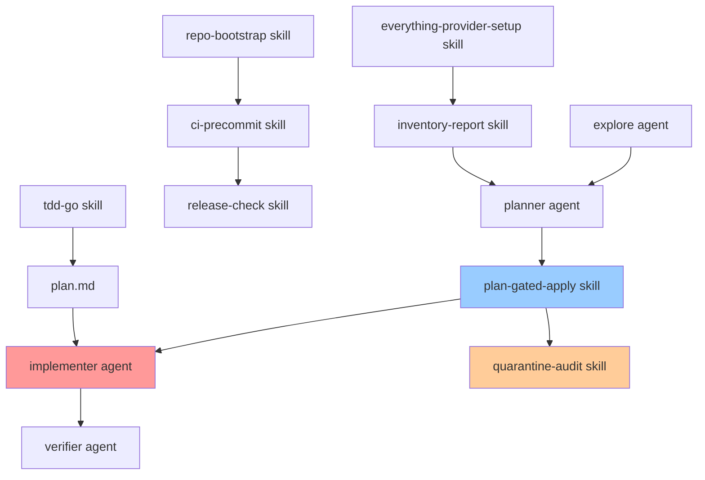

# Cursor Agents & Skills 통합 사용 가이드

> **목적:** `.cursor/agents/`와 `.cursor/skills/`를 효과적으로 함께 사용하는 방법을 안내합니다.

---

## 📋 목차

1. [개요](#개요)
2. [Agents vs Skills 구분](#agents-vs-skills-구분)
3. [의존성 맵](#의존성-맵)
4. [예시 워크플로우](#예시-워크플로우)
5. [사용 시나리오](#사용-시나리오)
6. [모범 사례](#모범-사례)

---

## 개요

### Agents (`.cursor/agents/`)
- **역할**: 특정 작업을 수행하는 **전문가 역할**
- **특성**: 항상 활성화되어 특정 컨텍스트에서 자동 선택
- **권한**: 대부분 read-only, `implementer`만 write 가능 (승인 후)

### Skills (`.cursor/skills/`)
- **역할**: 재사용 가능한 **워크플로우/절차**
- **특성**: 명시적으로 호출되는 on-demand 작업
- **권한**: 작업에 따라 다름 (read-only 또는 write)

### 핵심 원칙
- **Agents는 "누가"**, **Skills는 "무엇을"** 담당
- **Agents는 역할**, **Skills는 절차**
- **Plan→Approve→Apply** 플로우는 모든 write 작업에 필수

---

## Agents vs Skills 구분

### Agents (역할 기반)

| Agent | 모드 | 권한 | 주요 사용 시점 |
|-------|------|------|---------------|
| `explore` | fast | read-only | 코드베이스 구조 파악 필요 시 |
| `planner` | inherit | read-only | plan.json 설계/검증 시 |
| `implementer` | inherit | **write** | 코드 구현 (승인 후) |
| `reviewer` | fast | read-only | 보안/품질 검토 시 |
| `verifier` | fast | read-only | 작업 완료 검증 시 |
| `researcher` | fast | read-only | Everything 연동/보안 문서화 시 |
| `executor` | inherit | **write** | 파일 이동 실행 (승인 후) |
| `qa` | fast | **write** | 테스트 케이스 작성 시 |
| `approver` | fast | read-only | 승인 게이트 관리 시 |
| `coordinator` | fast | read-only | 복잡한 워크플로우 조정 시 |

### Skills (절차 기반)

| Skill | 유형 | 의존성 | 주요 사용 시점 |
|-------|------|--------|---------------|
| `everything-provider-setup` | 설정 | - | Everything 연동 초기 설정 |
| `everything-test` | 테스트 | `everything-provider-setup` | Everything 연동 테스트 |
| `tdd-go` | 개발 | `plan.md` | TDD 사이클 실행 |
| `plan-gated-apply` | 안전성 | `planner` agent | 파일 이동/정리 |
| `plan-validate` | 검증 | `planner` agent | Plan 검증 (승인 전) |
| `approval-gate` | 안전성 | `plan-validate` | 승인 게이트 관리 |
| `inventory-report` | 리포트 | Everything | 주간/월간 감사 |
| `quarantine-audit` | 정책 | `plan-gated-apply` | 삭제 요청 처리 |
| `snapshot-verify` | 검증 | `executor` agent | 스냅샷 무결성 검증 |
| `audit-query` | 조회 | - | 감사 로그 조회 |
| `repo-bootstrap` | 초기화 | - | 새 저장소 설정 |
| `ci-precommit` | 품질 | - | CI/Pre-commit 설정 |
| `release-check` | 검증 | `ci-precommit` | 릴리즈 전 체크 |
| `agent-selector` | 가이드 | - | 적절한 Agent 선택 시 |
| `rules-vs-skills` | 가이드 | - | Rules vs Skills 구분이 필요할 때 |

---

## 의존성 맵

### 전체 의존성 그래프



### 의존성 상세

#### 1. **개발 워크플로우**
```
explore → planner → plan-gated-apply → implementer → verifier
   ↓         ↓            ↓                ↓            ↓
  구조파악  계획설계    승인게이트      코드구현    검증
```

#### 2. **리포트 생성 워크플로우**
```
everything-provider-setup → inventory-report
        ↓
   Everything 연동 확인
```

#### 3. **초기 설정 워크플로우**
```
repo-bootstrap → ci-precommit → release-check
     ↓              ↓              ↓
  폴더구조      품질게이트      릴리즈체크
```

#### 4. **안전한 파일 이동 워크플로우**
```
plan-gated-apply → quarantine-audit (필요시)
        ↓
   Plan→Approve→Apply
```

#### 5. **TDD 개발 워크플로우**
```
tdd-go → plan.md → implementer → verifier
   ↓        ↓          ↓           ↓
 TDD루프  테스트큐   최소구현    검증
```

---

## 예시 워크플로우

### 시나리오 1: 새 프로젝트 초기 설정

**목표**: 저장소를 처음 설정하고 Everything 연동

**단계**:
1. **`repo-bootstrap` skill** 실행
   ```bash
   # .cursor/skills/repo-bootstrap/SKILL.md 참조
   # SSOT 폴더 구조 생성
   # - 00_INBOX/, 10_WORK/, 20_DEV/, 90_ARCHIVE/, 99_QUARANTINE/
   # - _meta/inventory/, _meta/reports/, _meta/plans/, _meta/audit/, _meta/snapshots/, _meta/approvals/
   ```

2. **`everything-provider-setup` skill** 실행
   ```bash
   # Everything ES CLI 또는 HTTP Server 설정
   ```

3. **`ci-precommit` skill** 실행
   ```bash
   # Pre-commit 훅 설치 및 검증
   pip install pre-commit
   pre-commit install
   pre-commit run --all-files
   pytest -q
   ```

4. **`explore` agent** 자동 호출
   - 코드베이스 구조 파악
   - 아키텍처 검증

**결과**: 
- ✅ 폴더 구조 생성
- ✅ Everything 연동 완료
- ✅ CI/Pre-commit 설정 완료
- ✅ 구조 문서화

---

### 시나리오 2: 주간 인벤토리 리포트 생성

**목표**: 주간 감사를 위한 인벤토리 리포트 생성

**단계**:
1. **`everything-provider-setup` skill** 확인
   ```bash
   # Everything 실행 상태 확인
   es.exe test
   ```

2. **`inventory-report` skill** 실행
   ```bash
   python -m inventory_master report --root "C:\inventory_master\"
   ```

3. **`explore` agent** (선택적)
   - 리포트 결과 분석
   - 이상 패턴 탐지

**결과**:
- ✅ `_meta/reports/`에 리포트 저장
- ✅ 확장자 통계, 큰 파일 목록 생성
- ✅ 다음 정리 작업 계획 수립 가능

---

### 시나리오 3: 파일 정리 (Plan→Approve→Apply)

**목표**: INBOX의 파일들을 적절한 폴더로 이동

**단계**:
1. **`inventory-report` skill** 실행
   ```bash
   # 현재 상태 파악
   python -m inventory_master report --root "C:\inventory_master\"
   ```

2. **`planner` agent** 호출
   - `plan.json` 생성
   - 분류 규칙 적용
   - 충돌 검사

3. **`plan-gated-apply` skill** 실행
   ```bash
   # 3-1. Plan 생성
   python -m inventory_master plan --root "C:\inventory_master\"
   
   # 3-2. 승인 (Human Gate)
   python -m inventory_master approve --plan "_meta/plans/<plan>.json"
   
   # 3-3. Dry-run (필수)
   python -m inventory_master apply --plan "_meta/plans/<plan>.json" --dry-run
   
   # 3-4. Apply
   python -m inventory_master apply --plan "_meta/plans/<plan>.json"
   ```

4. **`quarantine-audit` skill** (삭제가 필요한 경우)
   - `plan-gated-apply`와 함께 사용하여 `99_QUARANTINE/`로 이동
   - 30일 보관 정책 적용 (최소 30일 후 수동 삭제)
   - Audit trail 기록 (`_meta/audit/audit.jsonl`)
   - Before/After 스냅샷 생성 (`_meta/snapshots/`)
   - 30일 후 영구 삭제는 별도 승인 필요

5. **`verifier` agent** 호출
   - 적용 결과 검증
   - 스냅샷 비교
   - 해시 검증

**결과**:
- ✅ 안전한 파일 이동 완료
- ✅ Audit 로그 기록
- ✅ Before/After 스냅샷 저장
- ✅ 검증 완료

---

### 시나리오 4: TDD 개발 사이클

**목표**: `plan.md`의 다음 테스트 구현

**단계**:
1. **`tdd-go` skill** 실행
   ```bash
   # 사용자가 "go" 명령 실행
   ```

2. **`tdd-go` skill 내부 동작**:
   - `plan.md`에서 다음 미체크 테스트 선택
   - **RED**: 실패하는 테스트 작성
   - **GREEN**: 최소 구현
   - **REFACTOR**: 구조 개선 (행위 불변)

3. **`implementer` agent** 자동 호출
   - 최소 변경으로 구현
   - `src/**`, `tests/**`만 수정

4. **`verifier` agent** 호출
   ```bash
   pytest -q
   ```

5. **`plan.md` 업데이트**
   ```markdown
   - [x] test: ... # passed @2026-01-28 <commit:abcd1234>
   ```

**결과**:
- ✅ 테스트 통과
- ✅ `plan.md` 업데이트
- ✅ 커밋 준비 완료

---

### 시나리오 5: 릴리즈 전 검증

**목표**: 릴리즈 전 모든 품질 게이트 통과

**단계**:
1. **`release-check` skill** 실행
   ```bash
   # 체크리스트 자동 실행
   ```

2. **`release-check` skill 내부 동작**:
   - Coverage ≥ 85.00% 확인 (`pytest --cov=src --cov-report=term-missing`)
   - Lint/Format 검증 (`ruff check`, `ruff format --check`, `isort --check-only`)
   - Security 스캔 (`bandit -q -r src`, `pip-audit --strict`)
   - 문서 업데이트 확인 (`agents.md`, `docs/constitution.md`, `README.md`)
   - 안전 기본값 검증 (write/delete OFF, approval gates)
   - Pre-commit hooks 실행 (`pre-commit run --all-files`)

3. **`reviewer` agent** 호출
   - 보안 취약점 검토
   - 품질 메트릭 검증
   - 위험도 평가 (Critical/High/Medium/Low)

4. **`ci-precommit` skill** 재실행 (필요시)
   ```bash
   pre-commit run --all-files
   ```

**결과**:
- ✅ 모든 품질 게이트 통과
- ✅ 보안 검증 완료
- ✅ 릴리즈 준비 완료

---

## 사용 시나리오

### 시나리오 매트릭스

| 작업 유형 | 주요 Agent | 주요 Skill | 보조 Agent/Skill |
|-----------|------------|------------|------------------|
| **코드 탐색** | `explore` | - | - |
| **계획 설계** | `planner` | `plan-gated-apply` | `explore` |
| **코드 구현** | `implementer` | `tdd-go` | `verifier` |
| **품질 검토** | `reviewer` | `ci-precommit` | `release-check` |
| **작업 검증** | `verifier` | - | `reviewer` |
| **리포트 생성** | - | `inventory-report` | `everything-provider-setup` |
| **파일 이동** | `planner` | `plan-gated-apply` | `quarantine-audit` |
| **초기 설정** | - | `repo-bootstrap` | `everything-provider-setup`, `ci-precommit` |

### Agent 선택 가이드

**언제 `explore`를 사용?**
- 코드베이스 구조를 처음 파악할 때
- 아키텍처 검증이 필요할 때
- 주요 엔트리포인트를 찾을 때

**언제 `planner`를 사용?**
- `plan.json`을 설계할 때
- 분류 규칙을 검증할 때
- 충돌을 탐지할 때

**언제 `implementer`를 사용?**
- 코드를 작성/수정할 때 (승인 후)
- 테스트를 통과시키는 최소 구현이 필요할 때
- `plan.md`의 테스트를 구현할 때

**언제 `reviewer`를 사용?**
- 보안 취약점을 검토할 때
- 품질 메트릭을 평가할 때
- 릴리즈 전 최종 검토가 필요할 때

**언제 `verifier`를 사용?**
- 작업 완료 후 검증이 필요할 때
- 테스트 실행 및 결과 확인
- 스냅샷 비교 및 해시 검증

**언제 `coordinator`를 사용?**
- 복잡한 워크플로우가 필요할 때
- 여러 Agent/Skill을 순차적으로 사용해야 할 때
- 의존성 순서를 확인하고 싶을 때
- 적절한 Agent/Skill 조합을 찾고 싶을 때

### Skill 선택 가이드

**언제 `everything-provider-setup`을 사용?**
- Everything을 처음 연동할 때
- ES CLI 또는 HTTP Server 설정이 필요할 때

**언제 `tdd-go`를 사용?**
- 사용자가 "go" 명령을 실행했을 때
- `plan.md`의 다음 테스트를 구현할 때

**언제 `plan-gated-apply`를 사용?**
- 파일을 이동/이름변경할 때
- **반드시** Plan→Approve→Apply 플로우를 따라야 할 때

**언제 `inventory-report`를 사용?**
- 주간/월간 감사 리포트가 필요할 때
- 정리 작업 전 현재 상태를 파악할 때

**언제 `quarantine-audit`을 사용?**
- 파일 삭제가 요청되었을 때 (delete 금지 정책)
- 위험한 작업을 격리해야 할 때
- 중복 파일이나 사용하지 않는 파일을 처리할 때
- 30일 보관 정책이 필요한 파일 처리 시
- `plan-gated-apply`와 함께 사용하여 안전한 삭제 프로세스 실행

**언제 `repo-bootstrap`을 사용?**
- 새 저장소를 초기화할 때
- SSOT 폴더 구조를 재생성할 때
- `00_INBOX/`, `99_QUARANTINE/`, `_meta/*` 폴더 구조 복원이 필요할 때
- 프로젝트 초기 설정이 필요할 때

**언제 `ci-precommit`을 사용?**
- Pre-commit 훅을 설치할 때
- CI 설정이 필요할 때
- 품질/보안 자동화를 설정할 때
- 개발 환경 초기 설정 시
- CI가 실패할 때 (설정 검증)

**언제 `release-check`를 사용?**
- 릴리즈 전 모든 체크리스트를 확인할 때
- 품질/보안 게이트를 통과해야 할 때
- 태그 생성 전 최종 검증
- main 브랜치 머지 전 검증
- 프로덕션 배포 전 품질 확인

**언제 `agent-selector`를 사용?**
- 어떤 Agent를 사용해야 할지 모를 때
- Agent 역할과 권한을 이해해야 할 때
- Multi-agent 워크플로우를 계획할 때

**언제 `rules-vs-skills`를 사용?**
- Rules와 Skills의 차이를 이해해야 할 때
- 새로운 가이드라인을 Rules에 넣을지 Skills에 넣을지 결정할 때
- 팀이 Rules vs Skills 구분에 혼란스러워할 때

---

## 모범 사례

### ✅ DO

1. **항상 Plan→Approve→Apply 플로우 준수**
   - Write 작업은 반드시 `plan-gated-apply` skill 사용
   - 승인 없이는 절대 apply 금지

2. **Agents는 역할, Skills는 절차로 구분**
   - "누가"는 Agent, "무엇을"은 Skill

3. **의존성 순서 준수**
   - `explore` → `planner` → `implementer` → `verifier`
   - `everything-provider-setup` → `inventory-report`

4. **검증은 항상 마지막에**
   - 모든 write 작업 후 `verifier` agent 호출
   - `release-check` skill로 최종 검증

5. **TDD 사이클 준수**
   - `tdd-go` skill 사용
   - Red → Green → Refactor 순서

### ❌ DON'T

1. **승인 없이 write 금지**
   - `implementer` agent는 승인 후에만 사용
   - `plan-gated-apply` skill의 approve 단계 건너뛰기 금지

2. **의존성 무시 금지**
   - `inventory-report` 전에 `everything-provider-setup` 확인
   - `plan-gated-apply` 전에 `planner` agent로 plan 검증

3. **delete 직접 실행 금지**
   - 항상 `quarantine-audit` skill 사용
   - `99_QUARANTINE/`로 이동 후 30일 보관

4. **검증 생략 금지**
   - 모든 작업 후 `verifier` agent 호출
   - 릴리즈 전 `release-check` skill 필수

5. **규칙과 스킬 혼동 금지**
   - Rules는 항상 적용되는 정책
   - Skills는 명시적으로 호출되는 절차

---

## 빠른 참조

### Agent 호출 패턴
```
@explore          # 코드베이스 탐색
@planner          # 계획 설계
@implementer      # 코드 구현 (승인 후)
@reviewer         # 보안/품질 검토
@verifier         # 작업 검증
@researcher       # Everything 연동 문서화
@executor         # 파일 이동 실행 (승인 후)
@qa               # 테스트 케이스 작성
@approver         # 승인 게이트 관리
@coordinator      # 워크플로우 조정
```

### Skill 호출 패턴
```
/use everything-provider-setup
/use everything-test
/use tdd-go
/use plan-gated-apply
/use plan-validate
/use approval-gate
/use inventory-report
/use quarantine-audit
/use snapshot-verify
/use audit-query
/use repo-bootstrap
/use ci-precommit
/use release-check
/use agent-selector
/use rules-vs-skills
```

### 일반적인 워크플로우 체크리스트

**새 기능 개발:**
- [ ] `explore` - 구조 파악
- [ ] `tdd-go` - TDD 사이클
- [ ] `implementer` - 구현 (승인 후)
- [ ] `verifier` - 검증

**파일 정리:**
- [ ] `inventory-report` - 현재 상태 파악
- [ ] `planner` - 계획 설계
- [ ] `plan-gated-apply` - 안전한 적용
- [ ] `verifier` - 검증

**릴리즈 준비:**
- [ ] `release-check` - 체크리스트
- [ ] `reviewer` - 보안 검토
- [ ] `ci-precommit` - 최종 검증

---

## 문제 해결

### Q: 어떤 Agent를 사용해야 할지 모르겠어요
**A:** 작업 유형을 확인하세요:
- 읽기만 필요 → `explore`
- 계획 설계 → `planner`
- 코드 작성 → `implementer` (승인 후)
- 검토 필요 → `reviewer`
- 검증 필요 → `verifier`

### Q: Skill과 Agent를 함께 사용해야 하나요?
**A:** 네, 일반적으로 함께 사용합니다:
- Skill이 절차를 제공하고, Agent가 역할을 수행합니다
- 예: `plan-gated-apply` (skill) + `planner` (agent)

### Q: 승인 없이 코드를 작성할 수 있나요?
**A:** 아니요. `implementer` agent는 승인 후에만 사용해야 합니다. `plan-gated-apply` skill의 approve 단계를 반드시 거쳐야 합니다.

### Q: 의존성 순서를 무시하면 어떻게 되나요?
**A:** 오류가 발생하거나 예상치 못한 결과가 나올 수 있습니다. 항상 의존성 맵을 참조하여 올바른 순서로 실행하세요.

---

## 버전 정보

- **문서 버전**: v1.1
- **작성일**: 2026-01-28
- **최종 업데이트**: 2026-01-28 (Baseline 5-pack skills enhanced)
- **호환성**: Cursor IDE ≥ v0.36.0
- **관련 문서**: 
  - `agent.md` (SSOT)
  - `docs/constitution.md` (Non-negotiables)
  - `.cursor/agents/*.md` (Agent 정의)
  - `.cursor/skills/*/SKILL.md` (Skill 정의)
  - `.cursor/skills/SKILLS_INVENTORY.md` (Skills 상태 추적)

## 최근 업데이트 (2026-01-28)

### Enhanced Skills
다음 baseline skills가 상세한 문서로 업데이트되었습니다:

1. **`repo-bootstrap`** - 상세한 설정 가이드, PowerShell 예제, 트러블슈팅 추가
2. **`ci-precommit`** - 포괄적인 setup 가이드, hook 설정, CI 통합 예제 추가
3. **`release-check`** - 상세한 체크리스트, 검증 스크립트, 성공/실패 출력 추가
4. **`quarantine-audit`** - 워크플로우 예제, 30일 정책, audit trail, 롤백 프로세스 추가

모든 skills는 이제 다음을 포함합니다:
- 명확한 설명
- 상세한 지침
- 예제
- 통합 포인트
- 트러블슈팅 가이드

---

> **요약**: Agents는 "누가", Skills는 "무엇을" 담당합니다. Plan→Approve→Apply 플로우를 항상 준수하고, 의존성 순서를 지키며, 모든 write 작업 후 검증을 수행하세요.
